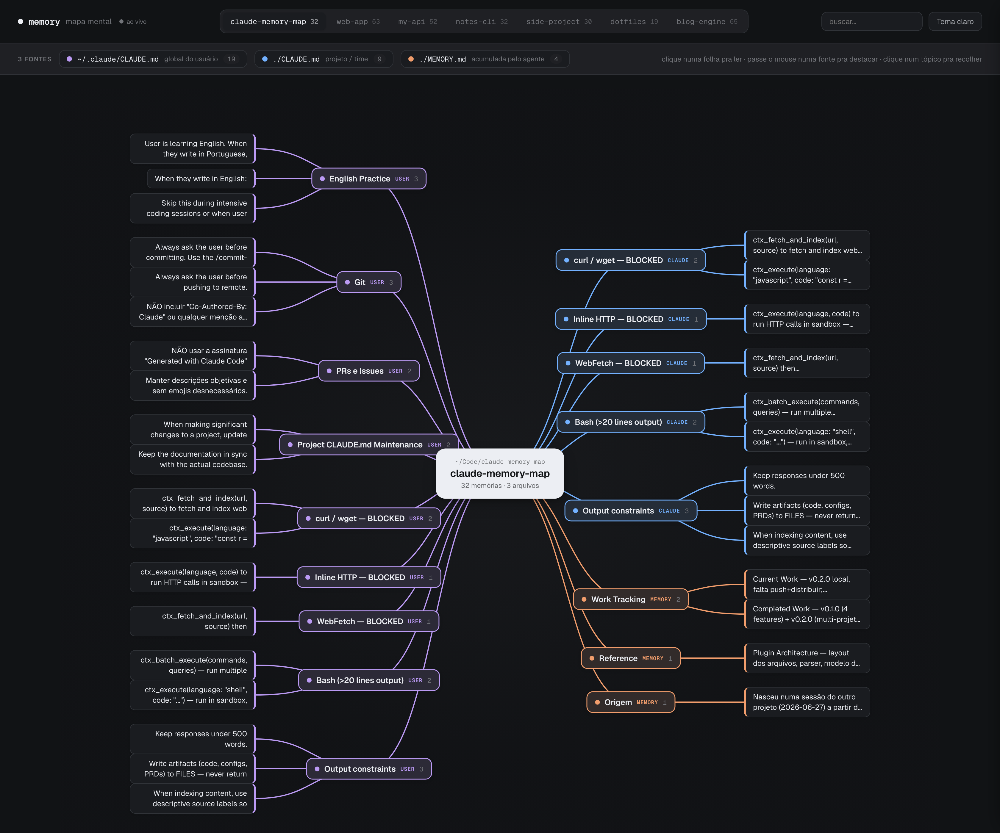

# 🧠 Memory Map

Visualizador **mapa mental** das memórias do Claude Code. Plugin que sobe um servidor
em `localhost` e mostra, num grafo interativo e bonito, **de onde vem cada instrução**
que o agente carrega num projeto.



Lê ao vivo as três fontes de memória e agrupa por seção de markdown
(cada `##`/`###` vira um **tópico**, cada bullet vira uma **folha**):

| Fonte | Papel | Cor |
|---|---|---|
| `~/.claude/CLAUDE.md` | global do usuário (igual em todo projeto) | roxo |
| `./CLAUDE.md` | projeto / time (versionado no repo) | azul |
| `./MEMORY.md` | acumulada pelo agente (auto-memory) | laranja |

## Recursos

- **Mapa mental** force-free de duas colunas, conectores Bézier — sem dependências (stdlib only).
- **Clique numa folha pra ler** o texto completo no painel lateral; folhas da `MEMORY.md`
  que apontam pra um arquivo (`↗`) carregam o **conteúdo do arquivo** referenciado.
- **Destaque por fonte** (hover), **recolher/expandir tópico** (clique), **tema claro/escuro**.
- **Seletor de projetos** — lista todos os projetos com memória em `~/.claude/projects/`.
- **Sempre fresco** — relê os arquivos a cada carregamento.

## Instalação (Claude Code)

```
/plugin marketplace add vavasilva/claude-memory-map
/plugin install memory-map@memory-map
```

## Uso

Dentro de um projeto, rode:

```
/memory-map            # porta padrão 8765
/memory-map 9000       # porta custom
```

Abre `http://localhost:8765` no navegador. Pra parar, mate o processo do servidor.

### Sem o Claude Code

```
cd /seu/projeto
python3 /caminho/para/claude-memory-map/serve.py
```

## Como funciona

- `serve.py` — servidor `http.server` (stdlib). Detecta o projeto atual pelo diretório de
  trabalho, descobre os demais via `~/.claude/projects/*/memory/MEMORY.md` (recuperando o
  caminho real de cada repo pelo `cwd` gravado nos transcripts `.jsonl`), parseia e serve.
  O endpoint `/file` só entrega arquivos dentro de `~/.claude` (lê o conteúdo das folhas da memória).
- `template.html` — o design (markup + layout + interações). O `serve.py` injeta os dados no
  lugar de `__DATA__` a cada request.

## Limitações conhecidas

- O `./CLAUDE.md` de outros projetos é resolvido pelo `cwd` gravado nos transcripts de sessão
  (`~/.claude/projects/*/*.jsonl`); projetos sem transcript — ou cujo repo foi movido/apagado —
  caem pro fallback (global + `MEMORY.md` apenas).
- Requer navegador moderno (`oklch()`, `color-mix()`). Fontes Geist via Google Fonts (cai pro
  system font sem internet).

## Créditos

Design "Memory Map" feito no Claude Design. Ideia de servir em localhost inspirada no
[`claude-memory-viz`](https://github.com/srijanshukla18/claude-memory-viz) — aqui adaptada pro
formato de memória de **arquivos** do Claude Code (não o MCP Knowledge Graph).
