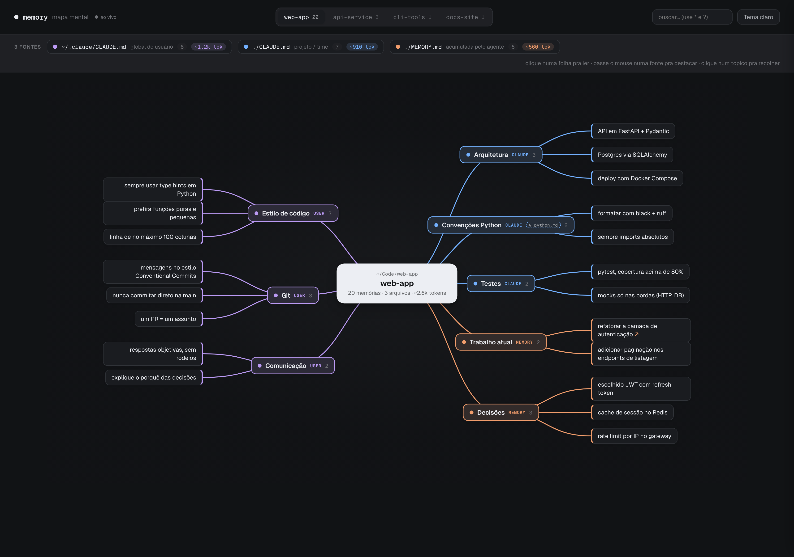

# 🧠 Memory Map

Visualizador **mapa mental** das memórias do Claude Code. Plugin que sobe um servidor
em `localhost` e mostra, num grafo interativo e bonito, **de onde vem cada instrução**
que o agente carrega num projeto.



Lê ao vivo as três fontes de memória e agrupa por seção de markdown
(cada `##`/`###` vira um **tópico**, cada bullet vira uma **folha**):

| Fonte | Papel | Cor |
|---|---|---|
| `~/.claude/CLAUDE.md` | global do usuário (igual em todo projeto) | roxo |
| `./CLAUDE.md` | projeto / time (versionado no repo) | azul |
| `./MEMORY.md` | acumulada pelo agente (auto-memory) | laranja |

## Recursos

- **Mapa mental** force-free de duas colunas, conectores Bézier — sem dependências (stdlib only).
- **Orçamento de tokens** — cada fonte mostra quantos tokens (~estimados, `chars/4`) injeta na sessão, e o
  nó central soma o total. O `~/.claude/CLAUDE.md` entra em **toda** sessão, então dá pra ver o custo fixo
  do seu contexto e enxugar o que pesa.
- **Resolve `@imports`** — segue os `@arquivo` do `CLAUDE.md` (recursivo, com guarda de ciclo) e mostra os
  tópicos importados marcados com `↳`, pra o mapa refletir o que é **realmente** carregado — não só o
  arquivo de cima. O texto importado também conta no orçamento de tokens.
- **Regras duplicadas e fonte mais pesada** — quando a mesma regra aparece em duas ou mais fontes (ex.: no
  global *e* no `./CLAUDE.md`), o mapa marca a folha com `⧉` (você paga os tokens em cada uma) e a legenda
  conta quantas; a fonte que mais pesa ganha o selo `mais pesada`. O orçamento sai de *informar* pra
  *mostrar o que cortar*.
- **Relatório no terminal** (`/memory-map:report`) — imprime o orçamento (tokens por fonte, total, fonte
  mais pesada, regras duplicadas) **sem abrir o navegador**; cabe em script, pre-commit ou CI.
- **Busca com curinga** — filtra o mapa em tempo real; `*` = qualquer trecho, `?` = 1 caractere, em qualquer posição. Ex.: `auth*token` casa "auth…token" em qualquer ponto; `te?t` casa "test"/"text". Sem curinga, é busca por trecho (substring). Ignora acentuação — `renovacao` acha "renovação".
- **Busca no conteúdo** — alcança o texto *dentro* dos arquivos de memória, não só os títulos no índice: um termo que só aparece num arquivo (ex. `v119`) ainda acende o nó. Resolvido no servidor (`/search`, com cache por mtime).
- **Lista de resultados** — ao buscar, um painel abaixo do campo lista o que casou (índice + conteúdo); clicar num item abre a memória direto no painel lateral, sem caçar o nó aceso no mapa.
- **Atalhos de teclado** — `/` (ou `Cmd`/`Ctrl`+`K`) foca a busca de qualquer lugar; na lista, `↑`/`↓` navegam, `Enter` abre o selecionado, `Esc` limpa.
- **Clique numa folha pra ler** o texto completo no painel lateral; folhas da `MEMORY.md`
  que apontam pra um arquivo (`↗`) carregam o **conteúdo do arquivo** referenciado. O termo
  buscado fica **destacado** no arquivo aberto, acompanhando curinga (`tcm*depl` marca "tcm" e
  "depl") e acento (`renovacao` marca "renovação").
- **Destaque por fonte** (hover), **recolher/expandir tópico** (clique), **tema claro/escuro**.
- **Seletor de projetos** — lista todos os projetos com memória em `~/.claude/projects/`.
- **Sempre fresco** — relê os arquivos a cada carregamento.

## Instalação (Claude Code)

```
/plugin marketplace add vavasilva/claude-memory-map
/plugin install memory-map@memory-map
```

## Uso

Dentro de um projeto, rode:

```
/memory-map            # porta padrão 8765
/memory-map 9000       # porta custom
/memory-map:report     # orçamento no terminal (não abre o navegador)
```

Abre `http://localhost:8765` no navegador. Pra parar, mate o processo do servidor.

### Sem o Claude Code

```
cd /seu/projeto
python3 /caminho/para/claude-memory-map/serve.py
```

### Relatório no terminal

No Claude Code: **`/memory-map:report`**. Ou direto (bom pra script, pre-commit ou CI):

```
python3 /caminho/para/claude-memory-map/serve.py --report
```

Mostra, pro projeto atual, os tokens (~estimados) por fonte, o total, a **fonte mais pesada** e as
**regras duplicadas** entre fontes (a mesma instrução no global e no `./CLAUDE.md`, por exemplo).

## Como funciona

- `serve.py` — servidor `http.server` (stdlib). Detecta o projeto atual pelo diretório de
  trabalho, descobre os demais via `~/.claude/projects/*/memory/MEMORY.md` (recuperando o
  caminho real de cada repo pelo `cwd` gravado nos transcripts `.jsonl`), parseia (seguindo os
  `@imports` do `CLAUDE.md` e contando os tokens de cada fonte) e serve.
  O endpoint `/file` só entrega arquivos dentro de `~/.claude` (lê o conteúdo das folhas da memória).
- `template.html` — o design (markup + layout + interações). O `serve.py` injeta os dados no
  lugar de `__DATA__` a cada request.

## Limitações conhecidas

- O `./CLAUDE.md` de outros projetos é resolvido pelo `cwd` gravado nos transcripts de sessão
  (`~/.claude/projects/*/*.jsonl`); projetos sem transcript — ou cujo repo foi movido/apagado —
  caem pro fallback (global + `MEMORY.md` apenas).
- Requer navegador moderno (`oklch()`, `color-mix()`). Fontes Geist via Google Fonts (cai pro
  system font sem internet).
- A contagem de tokens é uma **estimativa** (`chars/4`), não a do tokenizer real do modelo —
  serve pra comparar o peso relativo entre fontes, não pra bater exato com o uso de contexto.

## Créditos

Design "Memory Map" feito no Claude Design. Ideia de servir em localhost inspirada no
[`claude-memory-viz`](https://github.com/srijanshukla18/claude-memory-viz) — aqui adaptada pro
formato de memória de **arquivos** do Claude Code (não o MCP Knowledge Graph).
